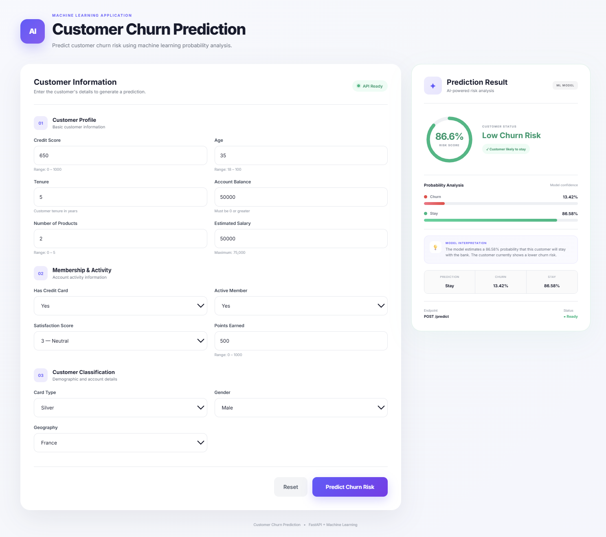

# 🏦 Bank Customer Churn Prediction

An end-to-end Machine Learning project that predicts whether a bank customer is likely to leave the bank (churn) based on customer demographics, account information, and behavioral attributes.

The project covers the complete machine learning workflow including data preprocessing, exploratory data analysis (EDA), feature engineering, model development, hyperparameter tuning, model evaluation, batch prediction, and deployment through a Streamlit and a web application.


UI of dashboard link : https://bank-customer-churn-prediction-risk-ctej.onrender.com

---

## 📌 Business Problem

Customer churn is a major challenge for banks and financial institutions. Acquiring a new customer is significantly more expensive than retaining an existing one.

The objective of this project is to identify customers who are likely to leave the bank so that proactive retention strategies can be implemented.

---

## 🎯 Project Objectives

* Analyze customer behavior and churn patterns.
* Identify key factors contributing to customer attrition.
* Build and compare multiple machine learning models.
* Optimize model performance using hyperparameter tuning.
* Deploy the final model through a Streamlit and web application.
* Enable real-time churn prediction.

---

## 📊 Dataset Information

**Dataset:** Bank Customer Churn Dataset

**Source:** Kaggle

### Dataset Size

* Total Records: **10,000**
* Total Features: **18**
* Target Variable: **Exited**

### Target Distribution

| Class       | Count | Percentage |
| ----------- | ----: | ---------: |
| Stayed (0)  | 7,962 |     79.62% |
| Churned (1) | 2,038 |     20.38% |

### Features

* CreditScore
* Geography
* Gender
* Age
* Tenure
* Balance
* NumOfProducts
* HasCrCard
* IsActiveMember
* EstimatedSalary
* Complain
* Satisfaction Score
* Card Type
* Point Earned
* And other customer-related attributes

### Target Variable

**Exited**

* 0 → Customer Stayed
* 1 → Customer Churned

---

## 🔍 Exploratory Data Analysis (EDA)

Several visualizations were created to understand customer churn patterns:

* Churn distribution analysis
* Geography-wise churn analysis
* Gender-wise churn comparison
* Age distribution analysis
* Balance vs churn relationship
* Active member impact on churn
* Product ownership analysis
* Correlation heatmap

### Key Findings

* Churn rate is approximately **20.38%**.
* Customers with complaints showed higher churn tendencies.
* Inactive members were more likely to churn.
* Customer age demonstrated a strong relationship with churn behavior.
* Geography and product ownership significantly influenced churn patterns.

---

## ⚙️ Data Preprocessing

The following preprocessing steps were performed:

* Removed irrelevant columns

  * RowNumber
  * CustomerId
  * Surname

* Handled categorical variables using encoding.

* Feature scaling using StandardScaler.

* Train-Test Split for model development.

* Built preprocessing pipelines for reproducibility.

---

## 🤖 Machine Learning Models

The following algorithms were trained and evaluated:

### 1. Logistic Regression

| Metric                 |  Score |
| ---------------------- | -----: |
| Accuracy               | 79.30% |
| ROC-AUC                | 74.57% |
| Cross Validation Score | 74.87% |

### 2. Decision Tree

| Metric                 |  Score |
| ---------------------- | -----: |
| Accuracy               | 84.65% |
| ROC-AUC                | 83.28% |
| Cross Validation Score | 82.50% |

### 3. Random Forest

| Metric                 |  Score |
| ---------------------- | -----: |
| Accuracy               | 85.15% |
| ROC-AUC                | 84.21% |
| Cross Validation Score | 83.67% |

---

## 🔧 Hyperparameter Tuning

Random Forest was optimized using GridSearchCV.

### Best Parameters

```python
{
    "class_weight": "balanced",
    "max_depth": 12,
    "min_samples_leaf": 2,
    "min_samples_split": 10,
    "n_estimators": 200
}
```

---

## 🏆 Optimized Random Forest Performance

| Metric                 |  Score |
| ---------------------- | -----: |
| Accuracy               | 83.40% |
| ROC-AUC                | 85.11% |
| Cross Validation Score | 84.61% |

### Why Optimized Random Forest Was Selected

Although the optimized model has slightly lower accuracy, it significantly improves churn detection performance:

| Metric                 | Before Tuning | After Tuning |
| ---------------------- | ------------: | -----------: |
| Recall (Churn Class)   |           40% |          65% |
| F1-Score (Churn Class) |           52% |          62% |
| ROC-AUC                |        84.21% |       85.11% |

For customer churn prediction, identifying customers who are likely to leave is more important than maximizing overall accuracy. Therefore, the optimized model provides better business value.

---

## 📈 Model Comparison

| Model                   | Accuracy |    ROC-AUC | Cross Validation |
| ----------------------- | -------: | ---------: | ---------------: |
| Logistic Regression     |   79.30% |     74.57% |           74.87% |
| Decision Tree           |   84.65% |     83.28% |           82.50% |
| Random Forest           |   85.15% |     84.21% |           83.67% |
| Optimized Random Forest |   83.40% | **85.11%** |       **84.61%** |

---

## 🚀 Deployment

The final optimized model was deployed using Streamlit  and a web application for real-time predictions.

### Features for Streamlit

* User-friendly interface
* Real-time single/batch churn prediction
* Instant prediction results & Download csv file 
* Batch prediction upload 'CSV' file 
* Model loaded from serialized file (`churn_model.pkl`)


### Features for Wab application 

* Clear and understanding UI interface
* Real-time prediction
* Beautiful prediction dashboard result 
* Showing probability analysis report and remarks of churning
---

## 📂 Project Structure

```text
Bank-Customer-Churn-Prediction/
│
├── Analysis_&_model.ipynb
├── Customer-Churn-Records.csv
├── train.csv
├── test.csv
├── main.py
├── predict.py
├── preprocess_records.py
├── app.py
├── churn_model.pkl
├── requirements.txt
├── README.md
└── .gitignore
```

---

## 🛠️ Tech Stack

* Python
* Html
* Java script
* css
* Pandas
* NumPy
* Matplotlib
* Seaborn
* Scikit-Learn
* Joblib
* Streamlit
* fastapi
* pydantic
* uvicorn

---

## 💡 Business Impact

This solution helps banks:

* Reduce customer attrition.
* Improve customer retention strategies.
* Identify high-risk customers early.
* Improve customer lifetime value.
* Support data-driven decision making.

---

## 📌 Future Improvements

* XGBoost and LightGBM implementation.
* Explainable AI using SHAP.
* Automated model retraining.

---

## 👨‍💻 Author

**Chiranjibi Pradhan**

Aspiring Data Scientist | Machine Learning Enthusiast

Skills: Python, SQL, Machine Learning, Data Analysis, Power BI, Streamlit
